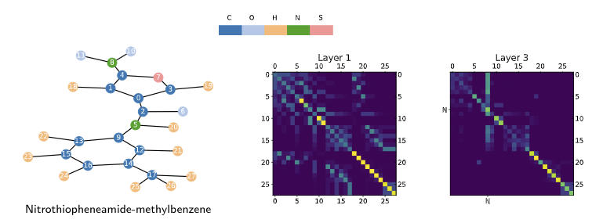

# Structural Graph Transformers 

This repository implements the Structural Graph Transformers (SGT) described in the following paper

## Short Description about SGT



SGT is an instance of transformers designed for graph-structured data. It takes as input a graph seens as a set of its node features, and integrates the graph structure via i) relative positional encoding using kernel on graphs and ii) encoding local substructures around each node before adding it to the node feature.

## Installation

Environment:
```
numpy=1.18.1
scipy=1.3.2
Cython=0.29.23
scikit-learn=0.22.1
matplotlib=3.4
networkx=2.5
python=3.7
pytorch=1.6
torch-geometric=1.7
```

The train folds and model weights for visualization are already provided at the correct location. Datasets will be downloaded via Pytorch geometric.

To begin with, run:
```
cd SGT
. s_env
```

To install GCKN, we also need to run:
```
make
```

## Training SGT on classification and regression tasks

All our experimental scripts are in the folder `experiments`. So to start with, run `cd experiments`.

#### Classification

To train SGT on NCI1 with diffusion kernel, run:
```bash
python run_transformer_cv.py --dataset NCI1 --fold-idx 1 --pos-enc diffusion --beta 1.0
```

Here `--fold-idx` can be varied from 1 to 10 to train on a specified training fold. To test a selected model, just add the `--test` flag.

To include Laplacian positional encoding into input node features, run:
```bash
python run_transformer_cv.py --dataset NCI1 --fold-idx 1 --pos-enc diffusion --beta 1.0 --lappe --lap-dim 8
```

To include GCKN path features into input node features, run:
```bash
python run_transformer_gckn_cv.py --dataset NCI1 --fold-idx 1 --pos-enc diffusion --beta 1.0 --gckn-path 5
```

#### Regression

To train SGT on ZINC, run:
```bash
python run_transformer.py --pos-enc diffusion --beta 1.0
```

To include Laplacian positional encoding into input node features, run:
```bash
python run_transformer.py --pos-enc diffusion --beta 1.0 --lappe --lap-dim 8
```

To include GCKN path features into input node features, run:
```bash
python run_transformer_gckn.py --pos-enc diffusion --beta 1.0 --gckn-path 8
```

## Visualizing attention scores

To visualize attention scores for SGT trained on Mutagenicity, run:
```
cd experiments
python visu_attention.py --idx-sample 10
```
To visualize Nitrothiopheneamide-methylbenzene, choose 10 as sample index.
To visualize Aminofluoranthene, choose 2003 as sample index.
If you want to test for other samples (i.e, other indexes), make sure that the model correctly predicts mutagenicity (class 0) for this sample.
